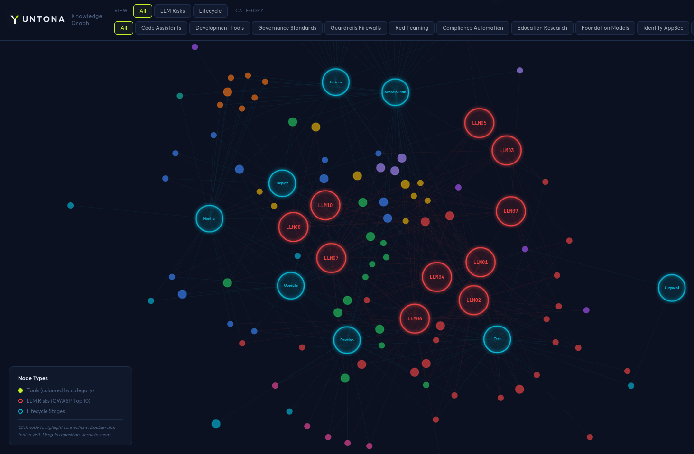

# Yuntona

**The curated AI security resource index** — 121 tools, frameworks, and standards mapped to the OWASP LLM Top 10 and LLMSecOps lifecycle.

[](https://yuntona.netlify.app)
[](https://yuntona.netlify.app)
[](https://owasp.org/www-project-top-10-for-large-language-model-applications/)
[](https://developer.mozilla.org/en-US/observatory/analyze?host=yuntona.netlify.app)
[](https://opensource.org/licenses/MIT)

Security professionals tasked with AI security face a fragmented landscape of tools, frameworks, and standards. New resources emerge weekly, and there's no single source of truth for what's available, what's mature, and what maps to which risks.

Yuntona maps 121 resources across 10 categories — filtered by OWASP LLM Top 10 risk, implementation complexity, lifecycle stage, and team role — so you can find what you need without 40 hours of research.

> 🌐 **[Explore the live index → yuntona.netlify.app](https://yuntona.netlify.app)**

---

## Who Is This For?

**For CISOs** handed the "AI security" brief and building a security posture from scratch.
**For GRC analysts** mapping tools to risk frameworks and vendor assessments.
**For security architects** evaluating guardrails, firewalls, and identity solutions for AI deployments.

This isn't a developer tool directory. It's a decision-making resource for the people who choose what gets deployed.

---

## What's Inside

| Category | Examples | Tools |
|----------|----------|:-----:|
| 🔴 AI Red Teaming | Garak, Promptfoo, HarmBench, BlackIce | 26 |
| 📊 Third-Party Risk | BitSight, Conveyor, Drata, Loopio | 18 |
| 📜 AI Governance & Standards | OWASP AI Exchange, ISO 42001, ETSI AI Security | 15 |
| 🛡️ AI Guardrails & Firewalls | LLM Guard, NeMo Guardrails, LlamaFirewall, E2B | 14 |
| 🔐 Identity & AppSec | GitGuardian, Noma Security, Aembit, Entro | 13 |
| 📚 Education & Research | Ken Huang, Lethal Trifecta, AI Incident Database | 9 |
| 🤖 Foundation Models | Ollama, Mistral, Hugging Face, DeepSeek | 7 |
| 🔧 AI Development Tools | LangChain, LlamaIndex, Langfuse, Arize Phoenix | 6 |
| 💻 AI Code Assistants | GitHub Copilot, Cursor, Continue, Tabnine | 5 |
| ✅ Compliance Automation | Sprinto, Delve, Scrut | 3 |

---

## Knowledge Graph

An interactive force-directed visualisation of all 121 tools and their relationships to OWASP LLM risks and lifecycle stages. Click any node to highlight its connections. Double-click a tool to visit it.

> 🕸️ **[Explore the knowledge graph → yuntona.netlify.app/graph.html](https://yuntona.netlify.app/graph.html)**



---

## How Resources Are Classified

### Complexity Tiers

Every tool is assessed for implementation complexity so you know what you're getting into before you evaluate:

| Tier | What It Means |
|------|---------------|
| 🟢 **Plug & Play** | Open a browser, click go. Minimal setup. |
| 🔵 **Guided Setup** | Some configuration needed. Documentation required. |
| 🟠 **Expert Required** | Security expertise needed. Non-trivial deployment. |
| 🟣 **Enterprise Only** | Full governance stack. Procurement process. |

### OWASP LLM Top 10

Each resource is tagged with the LLM risks it addresses:

| ID | Risk | ID | Risk |
|----|------|----|------|
| LLM01 | Prompt Injection | LLM06 | Sensitive Information Disclosure |
| LLM02 | Insecure Output Handling | LLM07 | Insecure Plugin Design |
| LLM03 | Training Data Poisoning | LLM08 | Excessive Agency |
| LLM04 | Model Denial of Service | LLM09 | Overreliance |
| LLM05 | Supply Chain Vulnerabilities | LLM10 | Model Theft |

### LLMSecOps Lifecycle

Resources are mapped to the stages where they apply:

```
Scope → Augment → Develop → Test → Release → Deploy → Operate → Monitor → Govern
```

---

## Live Index

The web interface at **[yuntona.netlify.app](https://yuntona.netlify.app)** offers:

- Full-text search across all resources
- AI-powered natural language queries
- Five filter dimensions: category, role, complexity, LLM risk, and lifecycle stage
- Active filter chips with one-click removal
- Website favicons for every tool via DuckDuckGo's privacy-friendly icon service
- Interactive knowledge graph for visual discovery of tool relationships

---

## Security

Yuntona is a static site with no cookies, no tracking, no login, and no external API calls from the main index. The site scores **115/100** on [Mozilla Observatory](https://developer.mozilla.org/en-US/observatory/analyze?host=yuntona.netlify.app), with:

- Strict Content Security Policy — no inline scripts, no inline event handlers
- Subresource Integrity on third-party scripts
- HSTS preloaded, X-Content-Type-Options, X-Frame-Options
- All favicons loaded via DuckDuckGo (privacy-friendly, no Google)

---

## Roadmap

- [x] Curated index with 121 resources across 10 categories
- [x] Web interface with multi-dimensional filtering
- [x] OWASP LLM Top 10 + lifecycle mapping
- [x] Complexity tiering system
- [x] Interactive knowledge graph (D3.js)
- [x] Community contribution workflow (issue templates + CONTRIBUTING.md)
- [ ] Semantic search (Typesense)
- [ ] AI-powered chatbot recommendations (Mistral)
- [ ] Tool-vs-tool comparison guides
- [ ] Quarterly AI Security Landscape briefing

---

## Contributing

Contributions are welcome. See [CONTRIBUTING.md](CONTRIBUTING.md) for detailed guidelines.

Quick options:

- [Suggest a tool](https://github.com/craftedbyfabio/yuntona/issues/new?template=tool-suggestion.md) — tool name, URL, and suggested category
- [Report an issue](https://github.com/craftedbyfabio/yuntona/issues/new?template=bug-report.md) — bugs, broken links, or incorrect mappings
- Fork the repo and submit a pull request

---

## About

Yuntona is curated by [Fabio](https://github.com/craftedbyfabio), a cybersecurity professional working at the intersection of third-party risk and AI security. Built from hands-on research into the OWASP GenAI ecosystem, CoSAI, the emerging agentic security landscape, and the conviction that AI security shouldn't require reinventing the wheel — the tools exist, they just need to be found.

---

## Acknowledgments

- [OWASP LLM Top 10](https://genai.owasp.org/resource/owasp-top-10-for-llm-applications-2025/)
- [OWASP GenAI Security Solutions Reference Guide](https://genai.owasp.org/resource/owasp-genai-security-project-solutions-reference-guide-q2_q325/)
- [OWASP Top 10 for Agentic Applications](https://genai.owasp.org/resource/owasp-top-10-for-agentic-applications-for-2026/)
- [MITRE ATLAS](https://atlas.mitre.org/)
- [CoSAI (Coalition for Secure AI)](https://github.com/cosai-oasis)
- [Ken Huang](https://kenhuangus.substack.com/) — MAESTRO framework co-creator, 16 books on AI security
- [Noma Security / Haize Labs](https://noma.security/) — RiskRubric AI model risk scoring
- [D3.js](https://d3js.org/) — knowledge graph visualisation

---

## License

MIT License. See [LICENSE](LICENSE) for details.

---

<p align="center">
  <strong>Crafted by Fabio</strong><br>
  <a href="https://yuntona.netlify.app">yuntona.netlify.app</a>
</p>
